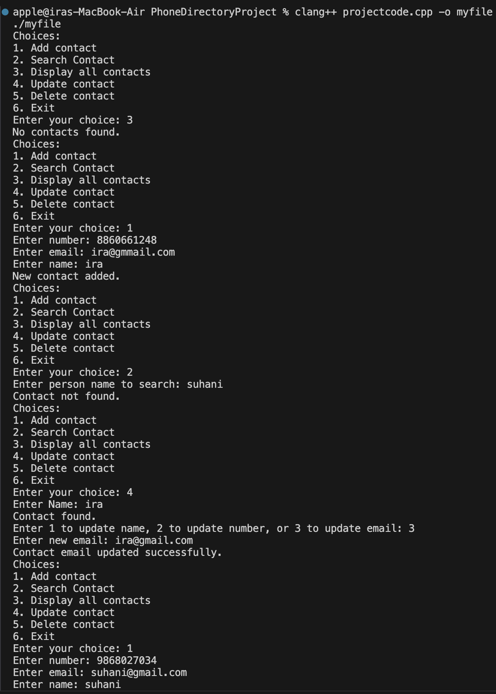
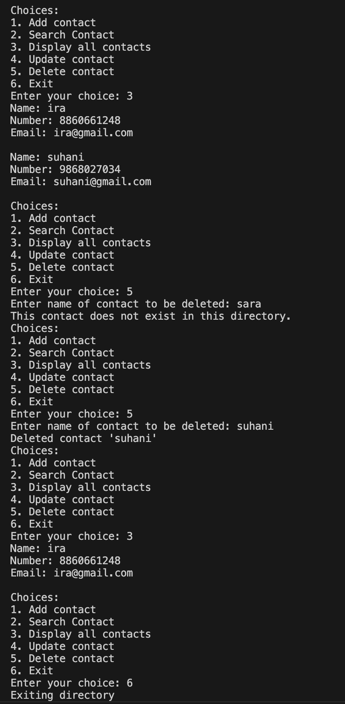

# Phone Directory Project
Course: Data Structures and Algorithms, Semester: 3

The aim of this project was to demonstrate understanding in fundamental concepts of any one data structure. This is a **Phone Directory** application written in C++ using **doubly linked lists** to manage contacts. The project provides core features like adding, updating, deleting, and searching contacts.

## Features

- Add a new contact (with name, 10-digit phone number, and email)
- Search contacts by name
- Update contact details (name, number, or email)
- Delete a contact
- Display all contacts (sorted alphabetically)

## Output 
|Add, Search, Update | Display, Delete, Exit |
|--------------------|-----------------------|
|  |  |
